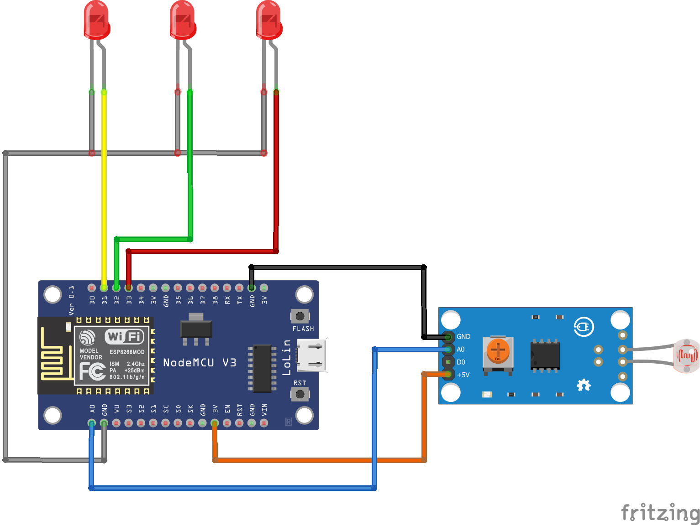

# Home-Automation-Sensor-Monitoring
Prototype for a Web-Based Remote Controller Interface for Electrical Appliances.

Electrical Appliances (or Other Devices) connected to the ecosystem can be remotely Powered ON / OFF via the Controller Webpage.

Feedback option via sensors to verify whether appliances are indeed Powered ON / OFF.

Replace LEDs in the circuit diagram with Electromagnetic / Solid-State Relays, connected to the main circuit of the appliance to be included in the ecosystem. Basically, replace the switch of the appliance on the switch board with the Electromagnetic / Solid-State Relay.

Installation of ESP8266 (NodeMCU) Support in the Arduino IDE required prior to compilation of the program.

Standard Arduino Microcontroller Boards (Uno, Nano, Mega, LilyPad, etc.) with ESP8266WiFi Integration can be used instead of ESP8266 (NodeMCU).

# Circuit-Diagram

  

